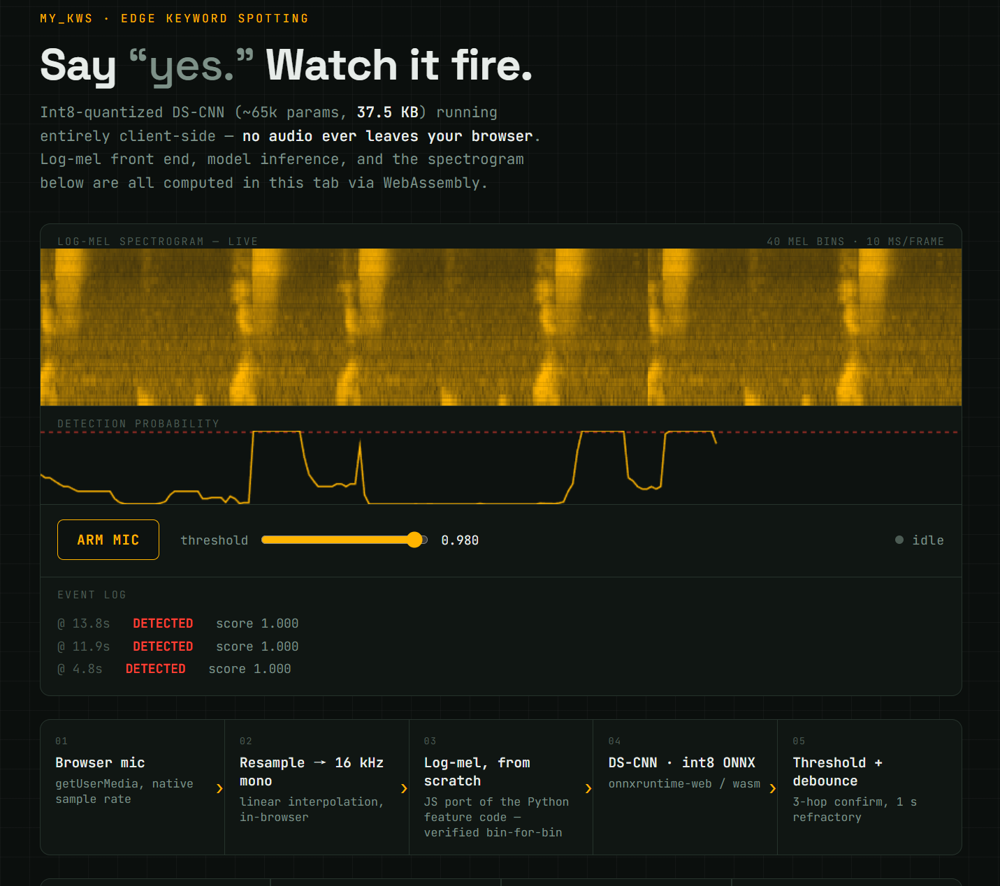

# my_KWS — edge keyword spotting

From-scratch keyword-spotting (KWS) pipeline for edge / wake-word detection:
hand-written log-mel front end (numpy) → DS-CNN (~65k params) → int8 ONNX
quantization → streaming detector (1 s window / 100 ms hop, debounce +
refractory).

**Test F1**: 0.981 · **Model size**: 37.5 KB (int8) · **Inference**: 0.15 ms p50
· **False accepts**: ~2.0/hour @ SNR 10dB

## Live demo

Try it in your browser — say **"yes"** into your mic. No install, no server:
feature extraction and inference both run client-side (onnxruntime-web /
wasm), so audio never leaves the tab.

👉 **https://huggingface.co/spaces/KuroeLove/my-kws-demo**

## Source: https://github.com/FengkaiLiu/my_KWS
